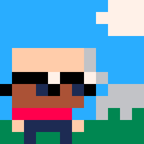

Hi there! My name is **Juan Colacelli** and I'm a solo indie game developer from Argentina 🇦🇷.

With over **twenty years of experience as a professional software developer**, I discovered my **long-held passion for retro pixel art games**.

I specialize in creating retro pixel art games using tools like [Godot Engine](https://godotengine.org), [Bevy](https://bevyengine.org/) and [SDL](https://libsdl.org) for game development, [Vim](https://vim.org) and [Visual Studio Code](https://code.visualstudio.com) for coding editor and [Aseprite](https://aseprite.org) and [Krita](https://krita.org) for graphics.

## Connect with me

You can **keep up with my latest projects and news by following me on [Twitter](https://twitter.com/juancolacelli), [Instagram](https://instagram.com/juancolacelli), [YouTube](https://youtube.com/@juancolacelli), and [Discord]()**.

Feel free to join my community, chat with other fans, and get sneak peeks of my latest projects.

## Support me

If you enjoy my work, please **consider supporting me on [Patreon]()**.

Your support helps me continue to create new and exciting games.

## Thank you!

Thank you for taking the time to **learn more about me and my work**.

If you have any questions or just want to say hi, feel free to **reach out**.

