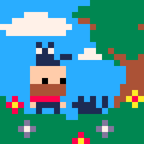
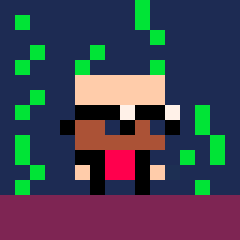
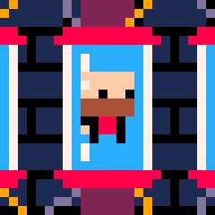

## Who am I

**Well, I'm Juan**.

I'm a **solo indie game developer** focused on **retro pixel art games**.

After more than twenty years as a professional software developer, I discovered my long-rooted passion for pixel art and [game development]().

## Tools

I mostly use [Godot Engine](https://godotengine.org) or [SDL](https://libsdl.org) for my games, [Vim](https://vim.org) as my code editor and [Aseprite](https://aseprite.org) for my drawings.

## Support me

If you like my work, please :pray: consider becoming a [Patreon member]()
