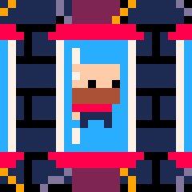

## Quién soy

**Bueno, mi nombre es Juan Colacelli**.

Soy un **desarrollador de videojuegos independiente** enfocado en **juegos pixel art retro**.

Luego de mas de veinte años como desarrollador de software profesional, descubrí mi arraigada pasión por el pixel art y el [desarrollo de videojuegos]().

## Herramientas

Mayormente uso [Godot Engine](https://godotengine.org) o [SDL](https://libsdl.org) para mis juegos, [Vim](https://vim.org) como editor de código y [Aseprite](https://aseprite.org) para mis dibujos.

## Dame soporte

Si te gusta mi trabajo, por favor :pray: considera convertirte [miembro en Patreon]()
