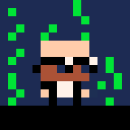

  

I'm Juan Colacelli, creator of [Logicalbot](https://logicalbot.com) and founder of [Tencrux](https://tencrux.com).

After working over 15 years at companies and graduating as Software Analyst, I started my current indie [game developer](/tags/gamedev) career.

I'm passionate about [development](/tags/dev), [game development](/tags/gamedev), [pixelart](/tags/pixelart) and music.

I'm also a fan of martial arts, and currently I reached blue belt grade in Brazilian Jiu-Jitsu at Quique Denegri academy.

### Contact

If you want to email me, feel free to do it at: (my name) at (my last name) dot com.
