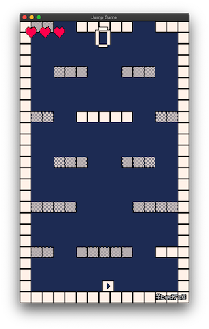

Mi vekas mian novan ludon, ĝi ankoraŭ ne havas nomon (mi nur nomas ĝin _"Jump Game"_), sed ĝi havas multe da amo ♥.

Jump Game temas pri saltado kaj evitado de pikiloj. Ĝi aspektas simpla, sed dum vi iras tra niveloj, ĝi fariĝas pli malfacila.

La ludo fontkodo estas tute farita per GDScript en ludmaŝino Godot [Godot](https://godotengine.org) kaj por la bildoj mi uzis [Aseprite](https://aseprite.org/) kun kolora paletro [PICO-8](https://lospec.com/palette-list/pico-8).

 

Rigardu la unuan ludan ekrankopion:

Baldaŭ mi afiŝos pliajn novaĵojn pri ĝi. **Restu en kontakto!**
