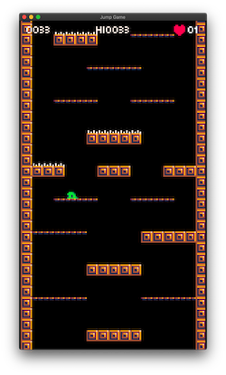

Hodiaŭ mi plibonigis la stilon kaj distingivon de mia nova ludo. Mi ŝanĝis bildan grandecon de 16 rastrumero al 8 rastrumero kaj ankaŭ plibonigis la kahelaron.

_Malgrandaj ŝanĝoj_

-   Tiparo ŝanĝiĝis de [Atlantis international](https://www.ffonts.net/Atlantis-International.font) al [Munro](https://www.ffonts.net/Munro.font) (malgranda).
-   Vidiga grandeco ŝanĝiĝis al malalta grandeco (135x240 rastrumero).
-   Rapido, salta alteco kaj gravito alĝustiĝis al nova grandeco.
-   Pikiloj nun havas minimuman prokraston antaŭ ol la kolizio estas ebligita, do ludanto povas eskapi antaŭ esti vundita.

