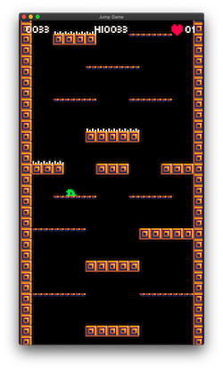

Hoy mejoré el estilo y resolución de mi nuevo juego. Cambié la resolución de 16px a 8px y también mejoré el tileset.

_Cambios menores_

-   Se cambió la fuente [Atlantis international](https://www.ffonts.net/Atlantis-International.font) por [Munro](https://www.ffonts.net/Munro.font) (small).
-   Se cambió la resolución a una menor (135x240px).
-   Se ajustó la velocidad, altura del salto y gravedad a la nueva resolución.
-   Los pinches ahora tienen un mínimo retraso antes de habilitar la colisión, así el jugador puede escapar antes de ser lastimado.

