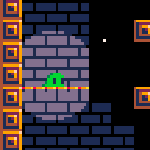

Bueno... No soy Dios, pero agregué luz a mi nuevo juego.

*Cambios hechos*
- Se agregó el shader de luz, usará la paleta de colores [PICO-8](https://lospec.com/palette-list/pico-8).
- Se agregó luz al jugador..
- Los tiles del piso (no traspasables) obstruirán la luz.
- Se agregaron fondo de ladrillos y estrellas.
- La luz será reflejada en los ladrillos, pero no en las estrellas.
