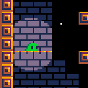

Well... I'm not God, but I added light to my new game.

*Changes made*
- Light shader has been added, it will just use [PICO-8](https://lospec.com/palette-list/pico-8) color palette colors.
- Light has been added to player.
- Floor tiles (without one way collision) will occlude light.
- Bricks and stars backgrounds have been added.
- Light will be reflected on bricks and not in the stars.
