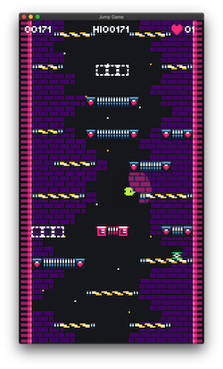

I've made some improvements on the tileset, limits will be less intrusive and one way floor will be more visible.

*Minor changes*
- Removed unused tiles from spritesheet.
- Background bricks and stars improved (moved to tileset instead of static image).
