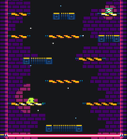

Hodiaŭ mi vekis ludlumojn.

Ludaj lumoj estis en la ludo ekde la komenco, sed ili funkciis pli kiel briloj anstataŭ lumoj.

Nun la ludo estas en mallumo kaj ĝi estas limigita per lumoj. Aldone saltotabulo kaj vivoj nun havas sian propran lumon.

Ankaŭ mi rimarkis, ke la lafo estis ekstertema, ĉar mi ŝanĝis la ludotemon.

Do lafo anstataŭĝis per lasero, kiu sekvos ludanton (ludanto mortas se ĝi traspasas).

_Malgrandaj ŝanĝoj_

-   Kahelaro reflektefiko pliboniĝis.
-   Luma ŝirmiloj forigitaj.
