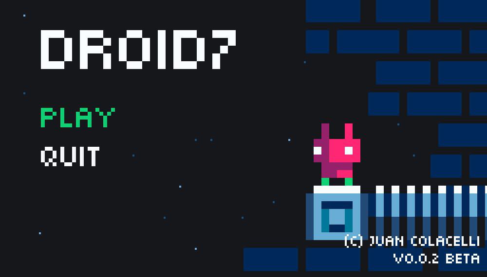
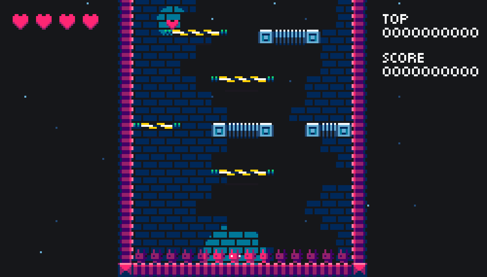
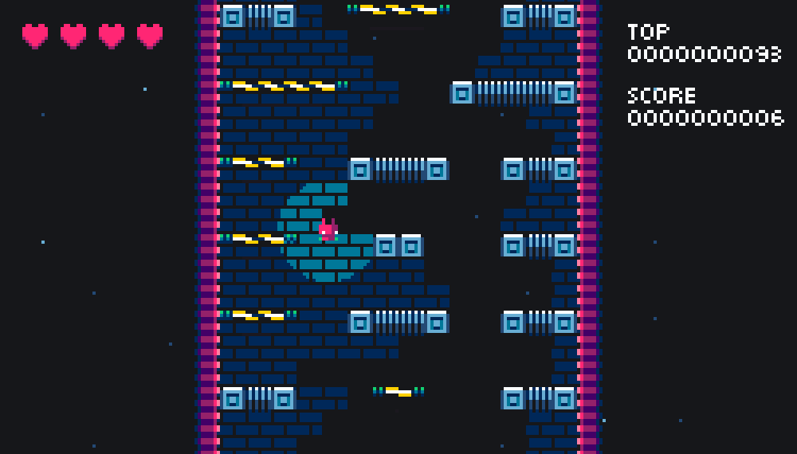

[DROID7]() estis kreita por _porteblaj aparatoj_, sed nun ĝi estas restrukturita por _surtablaj komputiloj_.

[DROID7]() 0.0.2-beta versio havas la jenanjn ludon ŝanĝojn:

- Fenestra aspekto ŝanĝiĝis al 16:9
- Ludanta movado per sagoklavoj (originale aŭtomatigitaj)
- Komenca ekrano ĝisdatigita
- Vivoj nun montriĝos kun koroj (originale kun nombroj)
- Supra poentaro kaj poentaro moviĝis de supre al la dekstra angulo
