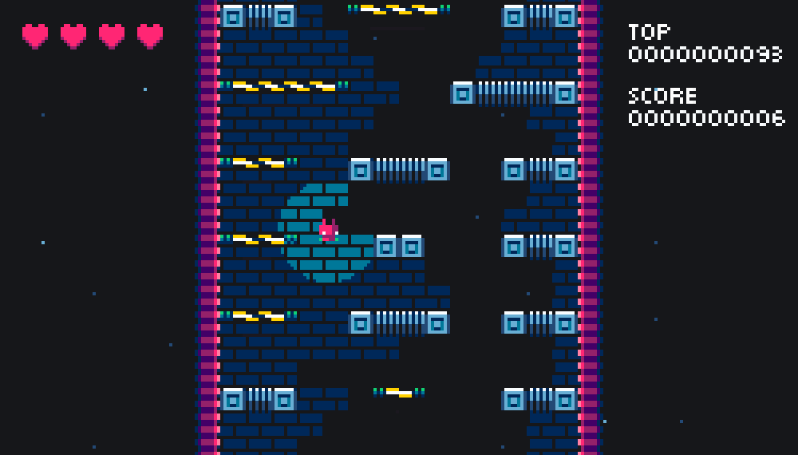

[DROID7]() fue originalmente creado para _dispositivos móviles_, pero ahora ha sido rediseñado para _computadoras de escritorio_.

[DROID7]() 0.0.2-beta cuenta con los siguientes cambios:

- Aspecto de ventana cambiado a 16:9
- Movimiento del jugador con flechas (originalmente automatizado)
- Pantalla de inicio actualizada
- Las vidas ahora se mostrarán con corazones (originalmente con números)
- Puntaje y récord movidos desde arriba hacia la esquina derecha

