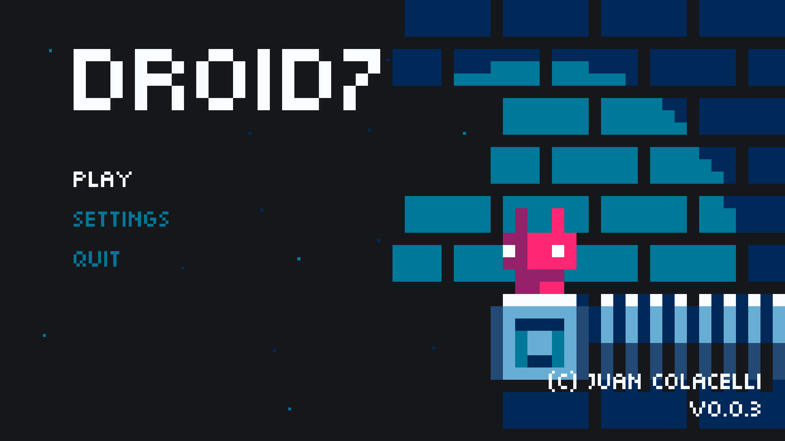
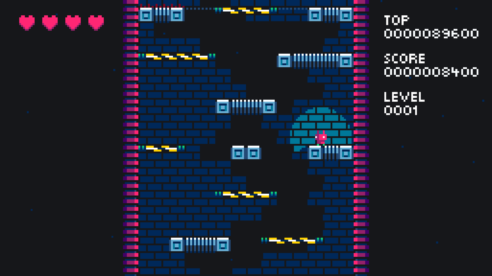

[DROID7]() v0.0.3 launched!

Introducing the levels, in the beginning the game will start paced off, and then it will be scaling and getting harder through levels.

Settings screen has been added with fullscreen support and volume sliders. Input settings screen has been added too with joystick support.

[DROID7]() 0.0.3 release has the following game changes:

-   Levels

    -   Difficulty scaling
    -   Level indicator

-   Lights

    -   Floor light obfuscation added

-   Start screen

    -   Menus now have lights
    -   Screens now have background music
    -   Menus now have sound on focus and press

-   Settings screen

    -   Fullscreen support
    -   Music volume
    -   Sound effects volume

-   Input settings screen

    -   Inputs listing
    -   Inputs edition
    -   Joystick support

-   Several bug fixes
