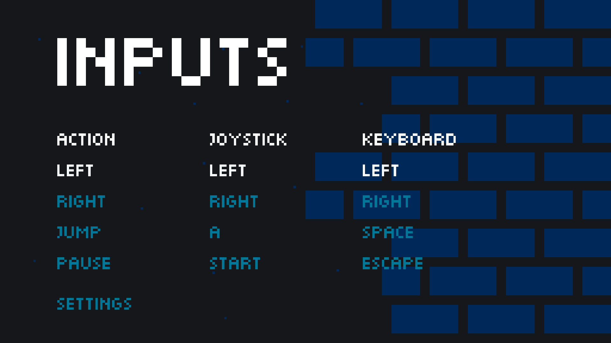
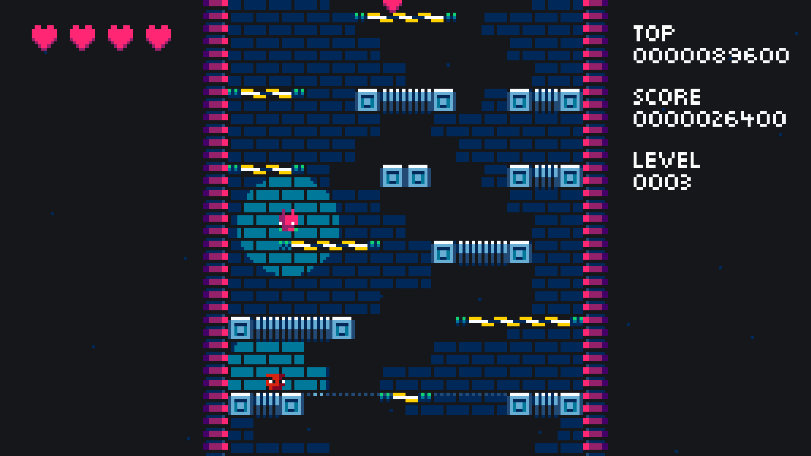

[DROID7]() v0.0.3 lanzado!

Los niveles al principio del juego comenzarán suaves, y luego a través de los niveles irán escalando y siendo más duros.

Se ha agregado la pantalla de configuraciones con soporte de pantalla completa y niveles de volúmen. También se agregó la pantalla de opciones de entradas con soporte de joystick.

[DROID7]() 0.0.3 cuenta con los siguientes cambios:

-   Niveles

    -   La dificultad ahora escala
    -   Indicador de nivel

-   Luces

    -   Se agregó bloqueo de luz al piso.

-   Pantalla de inicio

    -   Los menús ahora tienen luces
    -   La pantalla de configuraciónes ahora tiene música de fondo
    -   Agregado el sonido al seleccionar y presionar menús

-   Pantalla de configuraciones

    -   Soporte de pantalla completa
    -   Volúmen de la música
    -   Volúmen de los efectos de sonido

-   Pantalla de opciones de entrada

    -   Listado de entradas
    -   Edición de entradas
    -   Soporte de joystick

-   Severos arreglos de errores
