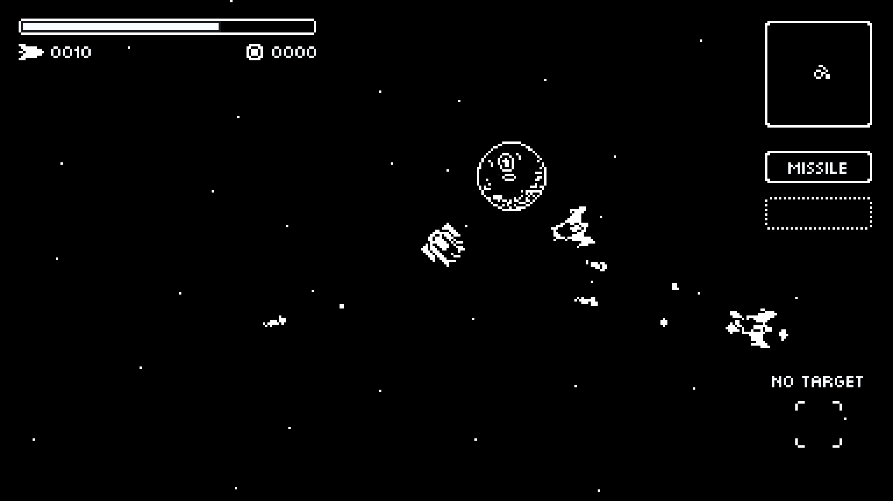

Well, new year :calendar:, new game :video_game:.

I always wanted to create a [1-bit]() game and in my childhood I played a lot of space shooter games :space_invader:, so I decided to combine both and create a [1-bit]() space [shooter]().

I'm working with [Godot Engine](https://godotengine.org) and [Aseprite](https://aseprite.org) using [1-bit]() colors (black and white only).

## Status

The game is in development, so **it is not yet published**.

This is how it's looking right now:

I will be posting more news soon!
