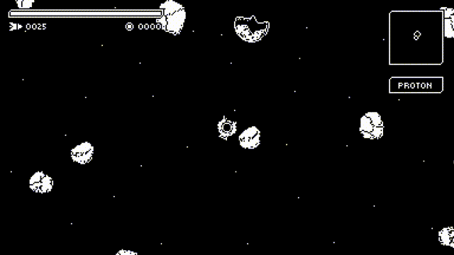
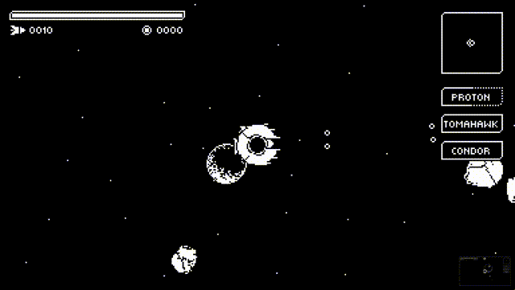
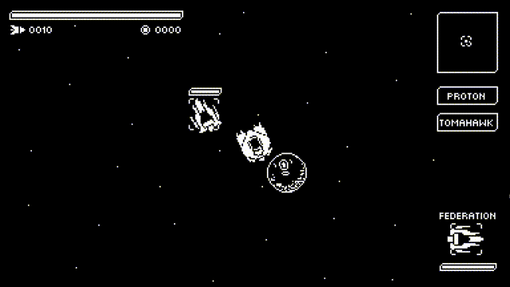
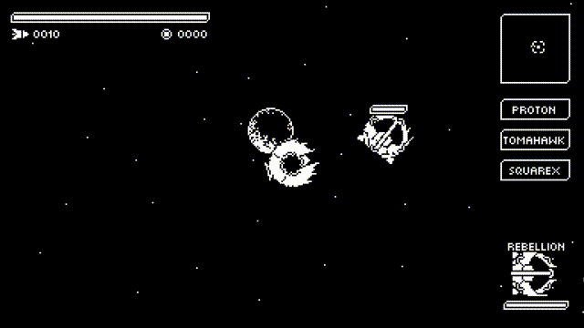
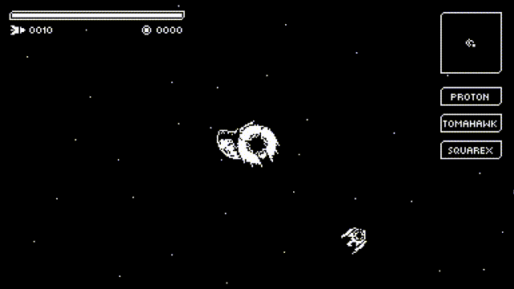

Introducing the following additions:

* [Asteroids]()
* [Weapon cooldown indicators]()
* [Auto-aim weapons]()
* [Shields]()
* [Chests]()

## Asteroids

Everybody loves asteroids, right?

Every planet has a probability to spawn asteroids.

When an asteroid is destroyed, it drops some credits.

## Weapon cooldown indicators

Small GUI update, now weapons have cooldown indicators.

## Auto-aim weapons

Some weapons (like missiles) have the ability to auto-aim.

## Shields

Spaceships now have the ability to wear shields. Shields act like a second life.

## Chests

When a spaceship is destroyed, it has a probability to drop a chest. Chest size depends on it's content.

