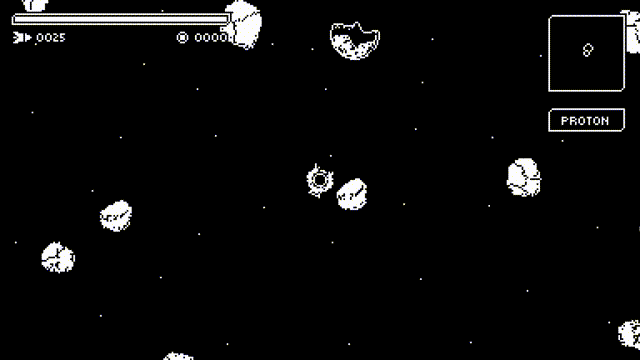

Enkondukante la sekvajn aldonojn:

* [Asteroidoj]()
* [Indikiloj de malvarmigo de armiloj]()
* [Aŭtomate-celaj armiloj]()
* [Ŝildoj]()
* [Kestoj]()

## Asteroidoj

Ĉiuj amas asteroidojn, ĉu ne?

Ĉiu planedo havas probablecon generi asteroidojn.

Kiam asteroido estas detruita, ĝi faligas kelkajn kreditojn.

## Indikiloj de malvarmigo de armiloj

Malgranda GUI-ĝisdatigo, nun armiloj havas malvarmigajn indikilojn.

## Aŭtomate-celaj armiloj

Kelkaj armiloj (kiel misiloj) havas la kapablon aŭtomate celi.

## Ŝildoj

Kosmoŝipoj nun havas la kapablon porti ŝildojn. Ŝildoj agas kiel dua vivo.

## Kestoj

Kiam kosmoŝipo estas detruita, ĝi havas probablecon faligi keston. Brusta grandeco dependas de ĝia enhavo.

