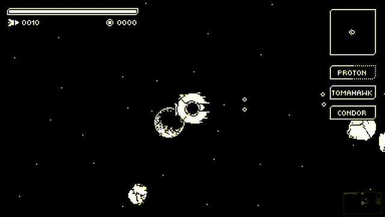
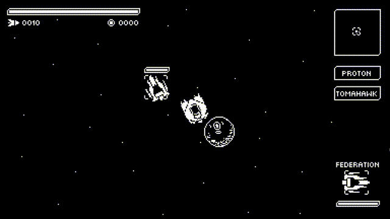

Presentando las siguientes adiciones:

* [Asteroides]()
* [Indicador de enfriamiento de armas]()
* [Armas auto-apuntables]()
* [Escudos]()
* [Cofres]()

## Asteroides

Todo el mundo ama a los asteroides, no es cierto?

Cada planeta tiene una probabilidad de generar asteroides.

Cuando un asteroide es destruído, tirará algunos créditos.

## Indicador de enfriamiento de armas

Una pequeña actualización de la GUI, ahora las armas tienen indicador de enfriamiento.
Small GUI update, now weapons have cooldown indicators.

## Armas auto-apuntables

Algunas armas (como los misiles) tienen la habilidad de auto-apuntar.

## Escudos

Las naves ahora tienen la habilidad de usar escudos. Los escudos actuan como una segunda vida.

## Cofres

Cuando una nave es destruída, hay una probabilidad de que tire un cofre. El tamaño de los cofres depende de su contenido.

