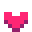
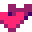
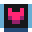
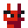
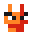
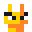
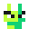
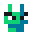

- [Blocks](#blocks)
- [Powers](#powers)
- [Specials](#specials)
- [Enemies](#enemies)
- [Secrets](#secrets)
- [Cheat codes](#cheat-codes)

## Blocks

Floor is made by blocks, and each type of block has unique properties.

| Block                                                                           | Description                                       |
| ------------------------------------------------------------------------------------------------ | ------------------------------------------------- |
|                      | Regular block                                     |
|                  | You can jump over this blocks                     |
|              | Disappear after 3 seconds                         |
|              | Appear/Disappear every 0.5 seconds                |
|  | Speed up/Slow down depending on the side you walk |

## Powers

Powers are items that could be picked up, they change your stats for a briefly size of time.

| Power                                                                        | Description                                             |
|-----------------------------------------------------------------------------------------------|---------------------------------------------------------|
|                      | Heal for 1 life                                         |
|            | Heal for 2 lives                                        |
|    | 1.4x Speed up for 5 seconds                             |
|                | 1.2x Speed up for 5 seconds                             |
|  | 0.8x Speed down for 5 seconds                           |
|                | Fly in a jetpack for 1.25 seconds                       |
|              | Grow up and break everything in your way for 10 seconds |
|                    | Freeze the time for 5 seconds                           |
|              | Pick an item from all the items pool                    |

## Specials

Specials are objects that can't be picked up but interact with DROID7.

| Special                                                                   | Description                       |
|--------------------------------------------------------------------------------------------|-----------------------------------|
|  | Jump higher using springboards    |
|            | Spikes hurt you                   |
|        | Teleport to a higher position |
|                | Escape!                           |

## Enemies

Enemies hurt DROID7 when they touch it,  all enemies have the same behaviour and make the same damage.

| Enemies                                                        | Description  |
|---------------------------------------------------------------------------------|--------------|
|        | Red enemy    |
|  | Orange enemy |
|  | Yellow enemy |
|      | Lime enemy   |
|    | Green enemy  |

## Secrets

- When you pick up a clock  laser movement is stopped, but also spikes  and floors    are disabled
- Spikes  take a little time to activate, you can use that lapse of time to jump and avoid damage
- You can jump just before touching the floor, that could help you to avoid spikes  damage
- You can find just one teleport  in all the building, if you see it, just take it
- Roulettes always cycle between all items in the same order (       )
- In the boss level you can find 2 lives  in the 7th brick, you just need to guide Doc to break it

## Cheat codes

*Cheat codes will ruin your game experience, they will make the game really easy to beat and maybe it could look boring, use them with consideration.*

You can use cheat codes by pausing the game and typing the code, some cheats need the level to be restarted to re-generate the map. If you want to stop using cheats, just restart the game completely and they will be gone.

| Code       | Description                                                                                                                   | Restart needed? |
|------------|-------------------------------------------------------------------------------------------------------------------------------|-----------------|
| `cool`     | Who doesn't want to wear sunglasses?                                                                                          | No              |
| `godlike`  | Immortality                                                                                                                   | No              |
| `healthy`  | Heal up to max health                                      | No              |
| `easy`     | Spikes  will no longer appear on the building       | Yes             |
| `freeze`   | Clocks  will appear more frequently                      | Yes             |
| `bounce`   | Springboards  will appear more frequently | Yes             |
| `maverick` | Jetpacks  will appear more frequently                | Yes             |
| `toad`     | Mushrooms  will appear more frequently             | Yes             |

