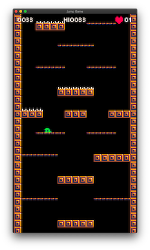

Today I improved the style and resolution of my new game. I changed sprite resolution from 16px to 8px and also improved the tileset.

*Minor changes*
- Font changed from [Atlantis international](https://www.ffonts.net/Atlantis-International.font) to [Munro](https://www.ffonts.net/Munro.font) (small).
- Display resolution changed to low resolution (135x240px).
- Speed, jump height and gravity adjusted to new resolution.
- Spikes now have a minimal delay before the collision is enabled, so player can escape before being hurt.

I'm creating the game character, do you have any suggestions? [Please contact me!](/about)
