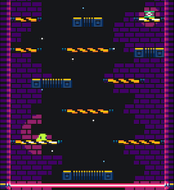

Today I've been woking on game lights.

Game lights have been in the game since the beginning, but they worked more like a glowing instead of lights.

Now the game is in darkness and it's enlightened by lights. Additionally springboard and lives now have their own light.

Also I noticed that lava was offtopic, since I changed the game theme.

So, lava has been replaced with a laser that will follow player along (player dies if it passes through).

*Minor changes*
- Tileset reflection effect improved.
- Light occluders removed.
