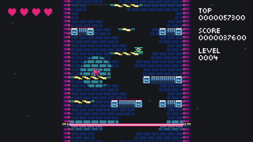

**DROID7** es un **juego de plataformas**, en el que hay que saltar hacia arriba en una torre generada mientras un rayo láser te persigue desde abajo.

Cuanto más alto vas, más rápido se vuelve, y no pasa mucho tiempo antes de que desaparezcan (y reaparezcan) plataformas y picos que se introducen para hacer tu vida más difícil.

Obtienes puntaje a medida que asciendes, y tu puntaje más alto se guarda.

"Si te gustan los DROIDs, estás en el lugar correcto, y sino, voy a encontrarte, y voy a matarte." —  DROID7

"Es lindo, realmente me gusta" — [Corey Dutson](https://twitter.com/cdutson)

"Me gusta, fue genial" — [Kaze-Karaage](https://twitter.com/Bgreaterthan)

"Lo disfruté. DROID7 es un buen juego" — [The Entity](http://the-entity.net/)

<iframe src="https://itch.io/embed/570980?linkback=true&amp;bg_color=16171a&amp;fg_color=fafdff&amp;link_color=ff2674&amp;border_color=16171a" width="208" height="167" frameborder="0"><a href="/droid7">DROID7</a></iframe>

## Creditos

Música por [Nicole Marie T](https://twitter.com/musicvsartstuff)

Música del jefe por [Locomule](https://opengameart.org/users/locomule)
