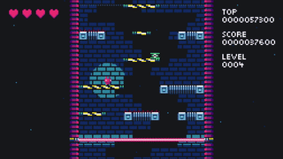

**DROID7** is a **platformer**, jump your way up on a generated tower while a laser beam chases you from below.

The higher you go, the faster it gets, and it isn't long before disappearing (and reappearing) platforms and spikes are introduced to make your life harder.

You gain score as you ascend, with your high score being saved.

"If you like DROIDs, you are in the right place, if you don't, I will find you, and I will kill you." —  DROID7

"It's cute, I really like it" — [Corey Dutson](https://twitter.com/cdutson)

"I like it, it was cool" — [Kaze-Karaage](https://twitter.com/Bgreaterthan)

"I enjoyed it. DROID7 is a good game" — [The Entity](http://the-entity.net/)

<iframe src="https://itch.io/embed/570980?linkback=true&amp;bg_color=16171a&amp;fg_color=fafdff&amp;link_color=ff2674&amp;border_color=16171a" width="208" height="167" frameborder="0"><a href="/droid7">DROID7</a></iframe>

## Credits

Music by [Nicole Marie T](https://twitter.com/musicvsartstuff)

Boss music by [Locomule](https://opengameart.org/users/locomule)
