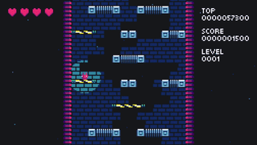
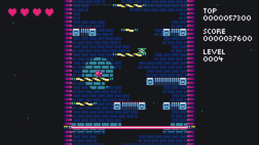

**DROID7** estas **platformo**, saltu sur generita turo dum lasera radio persekutas vin de sube.

Ju pli vi altas, des pli rapide ĝi fariĝas, kaj ne longe antaŭ malaperi (kaj reaperi) platformoj kaj pikiloj estas enkondukitaj por malfaciligi vian vivon.

Vi gajnas poentaron dum vi supreniras, kun via alta poentaro savita.

"Se vi ŝatas DROIDojn, vi estas en la ĝusta loko, se vi ne volas, mi trovos vin, kaj mi mortigos vin." —  DROID7

"Ĝi estas bela, mi tre ŝatas ĝin" — [Corey Dutson](https://twitter.com/cdutson)

"Mi ŝatas ĝin, estis mojosa" — [Kaze-Karaage](https://twitter.com/Bgreaterthan)

"iMi ĝuis ĝin. DROID7 estas bona videoludo" — [The Entity](http://the-entity.net/)

<iframe src="https://itch.io/embed/570980?bg_color=16171a&amp;fg_color=fafdff&amp;link_color=ff2674&amp;border_color=16171a" width="208" height="167" frameborder="0"><a href="/droid7">DROID7</a></iframe>

## Kreditoj

Muziko de [Nicole Marie T](https://twitter.com/musicvsartstuff)

Estra muziko de [Locomule](https://opengameart.org/users/locomule)
