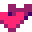
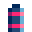
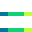
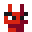
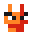
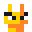
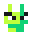
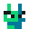

In the game [DROID7]() you can find

- [Blocks](#blocks)
- [Powers](#powers)
- [Specials](#specials)
- [Enemies](#enemies)

## Blocks

Floor is made by blocks, and each type of block has unique properties

| Block                                                                           | Description                                       |
| ------------------------------------------------------------------------------------------------ | ------------------------------------------------- |
|                      | Regular block                                     |
|                  | You can jump over this blocks                     |
|              | Disappear after 3 seconds                         |
|              | Appear/Disappear every 0.5 seconds                |
|  | Speed up/Slow down depending on the side you walk |

## Powers

Powers are items that could be picked up, they change your stats for a briefly size of time

| Power                                                                        | Description                                             |
|-----------------------------------------------------------------------------------------------|---------------------------------------------------------|
|                      | Heal for 1 life                                         |
|            | Heal for 2 lives                                        |
|    | 1.4x Speed up for 5 seconds                             |
|                | 1.2x Speed up for 5 seconds                             |
|  | 0.8x Speed down for 5 seconds                           |
|                | Fly in a jetpack for 1.25 seconds                       |
|              | Grow up and break everything in your way for 10 seconds |
|                    | Freeze the time for 5 seconds                           |
|              | Pick an item from all the items pool                    |

## Specials

Specials are objects that can't be picked up but interact with DROID7

| Special                                                                   | Description                       |
|--------------------------------------------------------------------------------------------|-----------------------------------|
|  | Jump higher using springboards    |
|            | Spikes hurt you                   |
|        | Teleport to a higher position |
|                | Escape!                           |

## Enemies

Enemies hurt DROID7 when they touch it, all enemies have the same behaviour and make the same damage

| Enemies                                                        | Description  |
|---------------------------------------------------------------------------------|--------------|
|        | Red enemy    |
|  | Orange enemy |
|  | Yellow enemy |
|      | Lime enemy   |
|    | Green enemy  |

