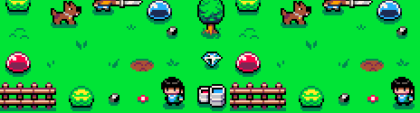

## Color palette light, what?

When you use a regular Light2D, Godot just increments the pixels' RGB values, whitening everything that is enlightened.

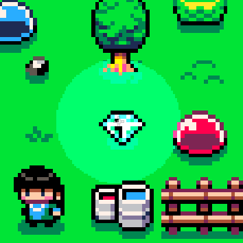

If you create your own light shader, you control every light and shadow color, and every pixel will be in your color palette, it makes your game more consistent.

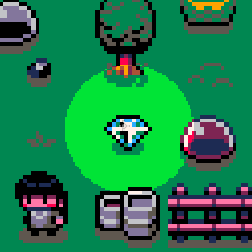


## Create the project

First you need to create a new project in Godot, using GLES3.


## Download the assets

For this tutorial we will be using the [PICO-8 color palette](https://lospec.com/palette-list/pico-8), so please download the [assets file](assets.zip) and decompress it into the project's folder.

[assets.zip](assets.zip) contains a folder called "assets" with the following images:

- [pico-8-palette-example-kingdom-of-nerea-in-pico-8-by-davit-masia.png](assets/pico-8-palette-example-kingdom-of-nerea-in-pico-8-by-davit-masia.png) (Lospec's PICO-8 example image)
- [light.png](assets/light.png)
- [pico-8_light.png](assets/pico-8_light.png)

Now your project's file structure must look like this:

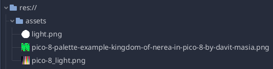

Reimport all 3 image assets as 2D Pixel.

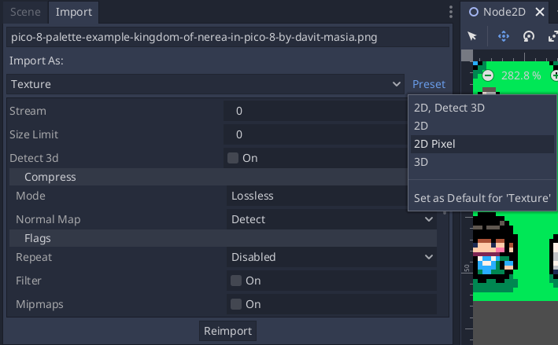


## Create the scene

Create a new 2D Scene and add the [Lospec's PICO-8 example image](assets/palette-list/pico-8-palette-example-kingdom-of-nerea-in-pico-8-by-davit-masia.png) to the tree and add a new Light2D.

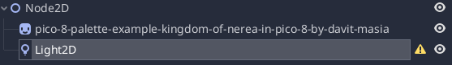

Then assign [light.png](assets/light.png) as Light2D texture, and put its mode as Mix.

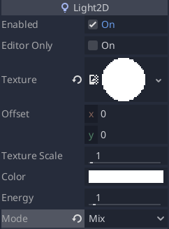


## Assign the shader

Select the "pico-8-palette-example-kingdom-of-nerea-in-pico-8-by-davit-masia" Node and assign a new ShaderMaterial and new Shader to it.

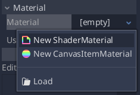

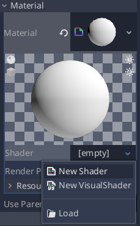

Copy and paste the shader code:

```c
shader_type canvas_item;

// Godot color palette light shader
// Author: Juan Colacelli
// Website: https://juancolacelli.com
// License: GNU GPLv3

uniform sampler2D color_palette;
uniform bool dark_mode = false;

vec4 getColorByMode(int index, int mode) {
  return texelFetch(color_palette, ivec2(index, mode), 0);
}

vec4 getColor(int index) {
  return getColorByMode(index, 1);
}

vec4 getLightColor(int index) {
  return getColorByMode(index, 2);
}

vec4 getDarkColor(int index) {
  return getColorByMode(index, 0);
}

int getColorPaletteIndex(vec4 color_to_find) {
  for (int i = 0; i < textureSize(color_palette, 0).x; i++) {
    if (color_to_find == getColor(i)) {
        return i;
    }
  }

  return -1;
}

void fragment() {
  vec4 pixel = texture(TEXTURE, UV);
  int color_palete_index = getColorPaletteIndex(pixel);

  if (color_palete_index > -1) {
    vec4 light_color = getLightColor(color_palete_index);
    vec4 dark_color = getDarkColor(color_palete_index);

    if (AT_LIGHT_PASS) {
      if (dark_mode) {
        COLOR = pixel
      } else {
        COLOR = light_color
      }
    } else {
      if (dark_mode) {
        COLOR = dark_color;
      } else {
        COLOR = pixel;
      }
    }
  } else {
    COLOR = vec4(1.0, 1.0, 0.0, 1.0);
  }
}
```

Now your Shader will have a new param called "Color Palette", assign [pico-8_light.png](assets/pico-8_light.png) to it.

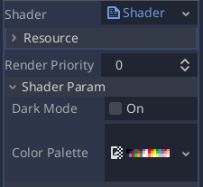

The shader will search the original color index, and replace it with its equivalent light or shadow color.

## Enjoy your new light!

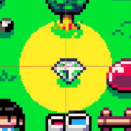

If you want to use the dark mode, enable in the shader's params.

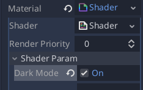

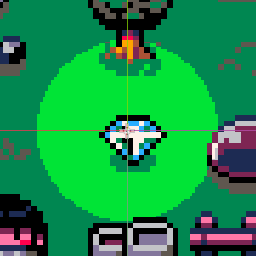

## How does the shader work?

"Color Palette" param has one image wich contains the original color palette color, and its light and shadow equivalences.


## Explore new options

If you change the "Color Palette" param for another image, you can use other palettes, or i.e an [B/W style light image](assets/pico-8_palette_bw.png).

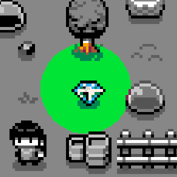


## Source code

View full project source code on: [GitLab](https://gitlab.com/juancolacelli/juancolacelli.com_tutorials/-/tree/master/00001-color-palette-light-with-godot)
